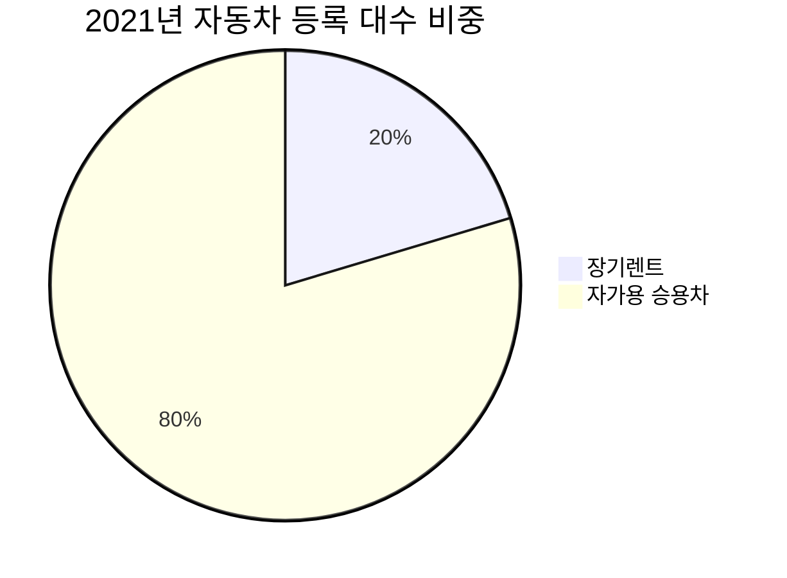

차량 구매를 고민하고 계신가요? 🤔 최근 장기렌트에 대한 관심이 높아지고 있는데요. 장기렌트가 차량 구매보다 유리한 경우 3가지를 소개합니다! 😊

## 1. 초기 비용 부담이 적어요 💰

차량을 구매할 때는 차량 가격의 20~30%에 해당하는 초기 비용이 필요합니다. 하지만 장기렌트는 초기 비용이 거의 들지 않아요. 보증금과 1회차 렌트료만 내면 바로 차량을 이용할 수 있죠. 

## 2. 유지 관리 비용이 들지 않아요 🔧

차량을 소유하면 유지 관리 비용이 만만치 않습니다. 세금, 보험료, 수리비 등 꾸준히 돈이 들어가는데요. 장기렌트는 이런 비용 걱정이 없어요. 월 렌트료에 포함되어 있거든요. 

## 3. 차량 가치 하락 리스크가 없어요 📉

새 차를 구매하면 시간이 지날수록 차량 가치가 하락합니다. 반면 장기렌트는 차량 가치 하락에 대한 리스크가 없어요. 계약 만료 후 차량을 반납하면 그만이니까요. 

실제로 장기렌트 비중은 꾸준히 증가하는 추세입니다. 국토교통부에 따르면 2021년 장기렌트 신규등록 대수는 전년 대비 28.1% 증가한 38만 3,824대를 기록했어요. 

*출처: 국토교통부, 2021년 자동차 등록 현황*

장기렌트에 대해 더 궁금하다면 "[장기렌트 FAQ](https://www.example.com/longterm-rent-faq)" 포스트를 참고해 보세요! 😄

#장기렌트 #장기렌트카 #자동차장기렌트 #장기렌트비용 #장기렌트장점